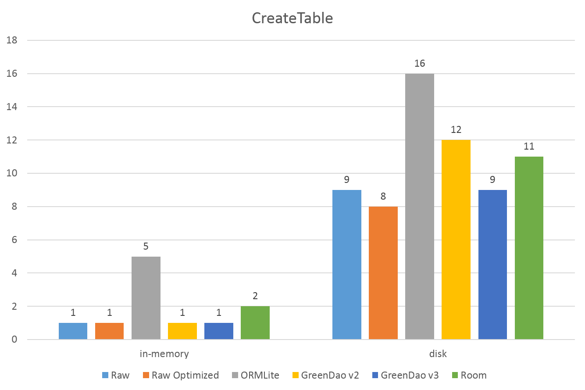
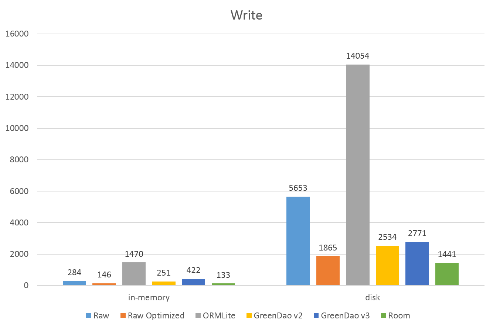
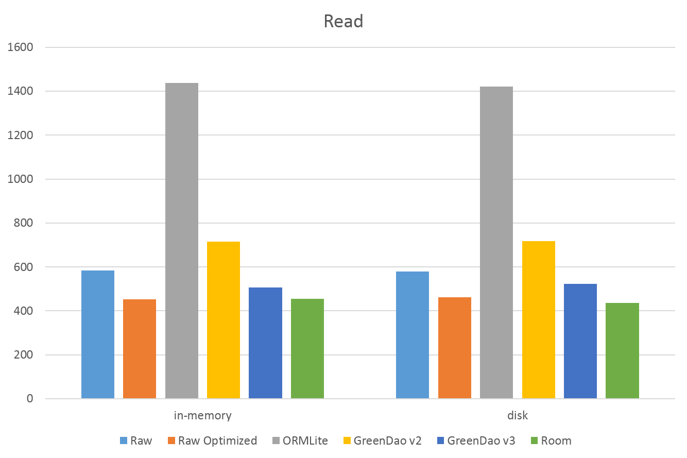
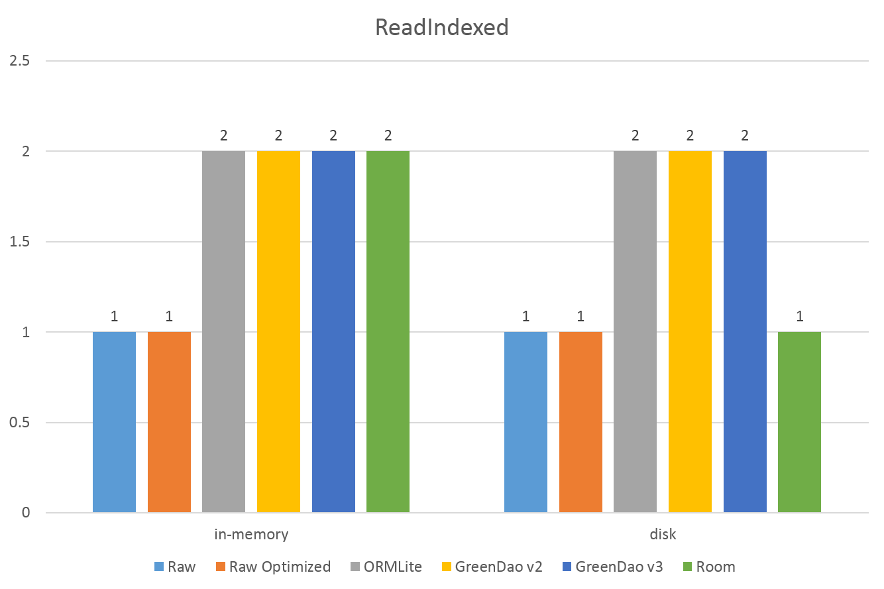
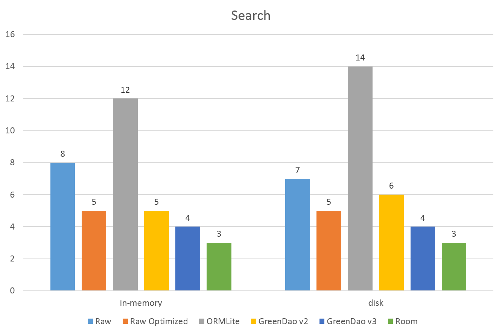
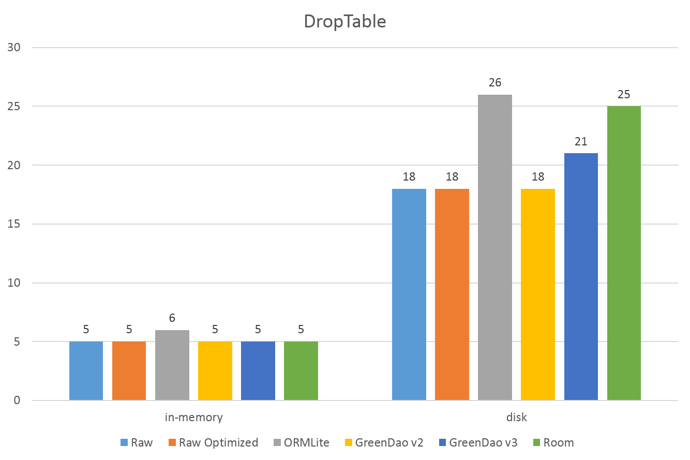

# android-orm-benchmark

## Summary

ORM-Benchmark is an Android application built in Android Studio that benchmarks the following against each other:

- [Android Raw SQLite](http://developer.android.com/guide/topics/data/data-storage.html#db)
- [Android SQLite API Optimized]
- [ORMLite](http://ormlite.com/)
- [GreenDAO v2 & v3](https://github.com/greenrobot/greenDAO)
- [Room Persistence Library](https://developer.android.com/topic/libraries/architecture/room.html)

The benchmark runs the following tasks:

- CREATE_TABLE - Creation of database structure
- WRITE_DATA - Writing 1000 'user' objects and 10000 'message' objects
- READ_DATA - Read all 10000 'message' objects in the table
- READ_INDEXED - Read an indexed field (the 5000th 'message' in the table)
- READ_SEARCH - Query the first 100 rows that matches a search term (using LIKE)
- DROP_TABLE - Drop database strucuture

Each task is run 50 times, and the application reports the average time for each in milliseconds.

## Results

Building and running the ORM-Benchmark project produces output similar to that below. 

- The times are in milliseconds.
- The results are shown on the device and are also logged to Logcat.  

The results below combine the in-memory database results with the on disk database results side by side. They are from a Nexus 6 Android 7.1.1.

- CREATE_TABLE

- WRITE_DATA

- READ_DATA

- READ_INDEXED

- READ_SEARCH

- DROP_TABLE

## Screenshots

After pressing "Run Benchmark" you can press "Show Results" to see the results:

## Technical Reference
### Customizing Benchmark Tests

- Enable/disable the usage of [in-memory](https://www.sqlite.org/inmemorydb.html) SQLite databases. Check [MainActivity#USE_IN_MEMORY_DB](/ORM-Benchmark/src/main/java/com/littleinc/orm_benchmark/MainActivity.java#L38)
- Number of times to run the tests. Check [MainActivity#NUM_ITERATIONS](/ORM-Benchmark/src/main/java/com/littleinc/orm_benchmark/MainActivity.java#L40)
- Implementing your own [BenchmarkExecutable](/ORM-Benchmark/src/main/java/com/littleinc/orm_benchmark/BenchmarkExecutable.java) you can add more tests.
- Search term. Check [BenchmarkExecutable#SEARCH_TERM](/ORM-Benchmark/src/main/java/com/littleinc/orm_benchmark/BenchmarkExecutable.java#L9)
- Search limit. Check [BenchmarkExecutable#SEARCH_LIMIT](/ORM-Benchmark/src/main/java/com/littleinc/orm_benchmark/BenchmarkExecutable.java#L11)
- Number of users to be saved into the db. Check [BenchmarkExecutable#NUM_USER_INSERTS](/ORM-Benchmark/src/main/java/com/littleinc/orm_benchmark/BenchmarkExecutable.java#L15)
- Number of messages to be saved into the db. Check [BenchmarkExecutable#NUM_MESSAGE_INSERTS](/ORM-Benchmark/src/main/java/com/littleinc/orm_benchmark/BenchmarkExecutable.java#L17)
- Number of messages with readers. Check [BenchmarkExecutable#NUM_MESSAGES_WITH_READERS](/ORM-Benchmark/src/main/java/com/littleinc/orm_benchmark/BenchmarkExecutable.java#L19)
- Number of reades on messages. Check [BenchmarkExecutable#NUM_READERS](/ORM-Benchmark/src/main/java/com/littleinc/orm_benchmark/BenchmarkExecutable.java#L13)

### Changing The GreenDao v2 Tests 

GreenDao v2 requires a separate project to generate the source code for database entities and DAOs. The ORM-Benchmark-GreenDAO-Generator project is a Java application that you can run to regenerate the database definitions. You only need to do this if you want to change the GreenDao database model!
